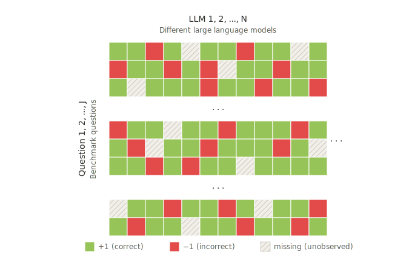

# An Interpretable and Scalable Framework for Evaluating Large Language Models
**Authors:** Xinhao Qu, Qiang Heng, Hao Zeng, Xiaoqian Liu (2026)
**arXiv:** [https://arxiv.org/abs/2605.07046](https://arxiv.org/abs/2605.07046)

<p align="center">
  
</p>

## Project Summary

1. We introduce an interpretable and scalable framework grounded in Item Response Theory (IRT) for evaluating LLMs based on the majorization–minimization (MM) principle. This approach reformulates the problem as a sequence of constrained matrix factorization subproblems, enabling stable and efficient parameter estimation at scale.
2. A novel MM-based computational framework (constrained Block MM, cBMM) well-suited for large-scale LLM evaluation tasks, offering reliable and meaningful interpretations of LLM capabilities.
3. Insightful empirical findings from MATH-500 and six Open LLM Leaderboard benchmarks that align with established parametric scaling laws and capture fine-grained item heterogeneity.

## Repository Layout

```text
quickstart/
  demo.py
  cBMM.py
IRToptimizer/
  runner.py
  utils.py
  runner_config.json
  cBMM/
    cBMM_logit.py
  py-irt/
    PyIRT_logit.py
  mirt/
    runner_mirt.R
    utils_mirt.R
    failure_example/
      collinearity.R
      identical_response.R
      bigJ.R
data/
  BBH.csv
  GPQA.csv
  IFEval.csv
  MATH.csv
  MATH_500.csv
  MMLU_PRO.csv
  MuSR.csv
assets/rank_info/
  BBH.csv
  GPQA.csv
  IFEval.csv
  MATH.csv
  MATH_500.csv
  MMLU_Pro.csv
  MuSR.csv
requirement.txt
```

## Data Description

In total, this project examines seven benchmark suites. The datasets vary in the number of benchmark items (J) and the number of LLMs evaluated (N), drawn from two primary sources.

### Overview

| Benchmark Suite | Number of Items | Number of LLMs | Source |
| :---: | :---: | :---: | :---: |
| **MATH-500** | 500 | 140 | LART |
| **IFEval** | 541 | 2,211 | HF Open LLM Leaderboard v2 |
| **MuSR** | 756 | 2,211 | HF Open LLM Leaderboard v2 |
| **GPQA** | 1,192 | 2,211 | HF Open LLM Leaderboard v2 |
| **MATH** | 1,324 | 2,211 | HF Open LLM Leaderboard v2 |
| **BBH** | 5,761 | 2,211 | HF Open LLM Leaderboard v2 |
| **MMLU-Pro** | 12,032 | 2,211 | HF Open LLM Leaderboard v2 |

### Provenance & Collection Details

* **MATH-500 Benchmark Suite:**
    * This suite encompasses a diverse set of 140 LLMs released between July 2023 and September 2025, featuring varying model sizes.
    * We adopt the evaluation data collected by LART (Xu et al., 2025).
* **Hugging Face Open LLM Leaderboard:**
    * The remaining six suites (IFEval, MuSR, GPQA, MATH, BBH, and MMLU-Pro) are drawn from the Hugging Face Open LLM Leaderboard.
    * Evaluations were conducted between June and December 2024 under the Leaderboard v2 schema.
    * The raw historical evaluation data was obtained via the `huggingface_hub` API, as curated by Wu et al. (2026).

## Environment Setup

Install dependencies via

```bash
pip install -r requirement.txt
```

## Quick Start

```python
import numpy as np
from cBMM import cBMM

# Build an N x J binary matrix with entries in {-1, +1}
N, J, r = 50, 40, 5
Y = np.random.choice([-1.0, 1.0], size=(N, J))

result = cBMM(
    Y=Y,
    r=r,
    sigma=1.0,
    ind_omega=None,   # Pass a mask here for missing observations
    tol=1e-4,
    max_iter=500,
    verbose=20,
    num_threads='auto'
)

print("Iterations:", result["n_iter"])
print("X_hat shape:", result["X_hat"].shape)
```

Or run the demo script:

```bash
python quickstart/demo.py
```

## Input

- `Y`: binary matrix, values are expected to be `-1` or `+1`
- `r`: factorization rank (latent dimension)
- `sigma`: scaling parameter in the loss
- `ind_omega`: optional observation mask, length must be `N*J` (column-major order)
- `init_U1`, `init_V1`, `init_v2`: optional initial values
- `tol`: relative convergence tolerance
- `max_iter`: maximum number of iterations
- `verbose`: print frequency (`0` disables printing)
- `num_threads`: `'auto'`, integer, or `None`

## Output

`cBMM(...)` returns a dictionary with:

- `U1`: left factor matrix, shape `(N, r)`
- `V1`: right factor matrix, shape `(J, r)`, non-negative
- `v2`: column bias vector, shape `(J,)`
- `X_hat`: reconstructed matrix, shape `(N, J)`
- `loss_history`: loss values over iterations
- `n_iter`: number of iterations executed
- `ind_omega`: input observation mask

## Metrics for sensitivity analysis

For simulation runs where ground-truth model parameters, item parameters, and the score matrix are known, `IRToptimizer/utils.py` defines `compute_metrics(...)`. The same metric definitions are mirrored in R (`IRToptimizer/mirt/utils_mirt.R`). `IRToptimizer/runner.py` aggregates these per seed into result tables.

Reported quantities include:

- `rmse_theta`, `rmse_a`, `rmse_b`: root mean squared error of estimated vs true $\theta$, item loadings $a$, and intercepts $b$
- `theta_rank_corr`, `a_rank_corr`, `b_rank_corr`: Spearman rank correlation between estimates and truth
- `m_rel_fnorm`: relative Frobenius recovery error for the true score matrix vs its estimate
- `hellinger_distance`: Hellinger distance between elementwise logistic probabilities from true score matrix and its estimate
- `class_error_val`: fraction of incorrect predictions on validation indices for binary ground-truth label vs held-out responses
- `missing_rate`: validation / missing fraction passed in as `val_ratio`
- `run_time_sec`, `final_loss`, `iterations`: runtime, final objective, and iteration count

## References

1. Skyler Wu, Yash Nair, Emmanuel J. Candès. *Efficient Evaluation of LLM Performance with Statistical Guarantees.* arXiv preprint arXiv:2601.20251, 2026.  
   [https://arxiv.org/abs/2601.20251](https://arxiv.org/abs/2601.20251)

2. Zhiyu Xu, Jia Liu, Yixin Wang, Yuqi Gu. *Latency-Response Theory Model: Evaluating Large Language Models via Response Accuracy and Chain-of-Thought Length.* arXiv preprint arXiv:2512.07019, 2025.  
   [https://arxiv.org/abs/2512.07019](https://arxiv.org/abs/2512.07019)

3. John Patrick Lalor, Pedro Rodriguez. *py-irt: A Scalable Item Response Theory Library for Python.* *INFORMS Journal on Computing* 35 (1): 5–13, 2023.  
   [https://doi.org/10.1287/ijoc.2022.1250](https://doi.org/10.1287/ijoc.2022.1250)

4. R. Philip Chalmers. *mirt: A Multidimensional Item Response Theory Package for the R Environment.* *Journal of Statistical Software* 48 (6): 1–29, 2012.  
   [https://doi.org/10.18637/jss.v048.i06](https://doi.org/10.18637/jss.v048.i06) 

## Contact

Please reach out to xiaoqian.liu@ucr.edu and xinhao.qu@email.ucr.edu for any questions. 
